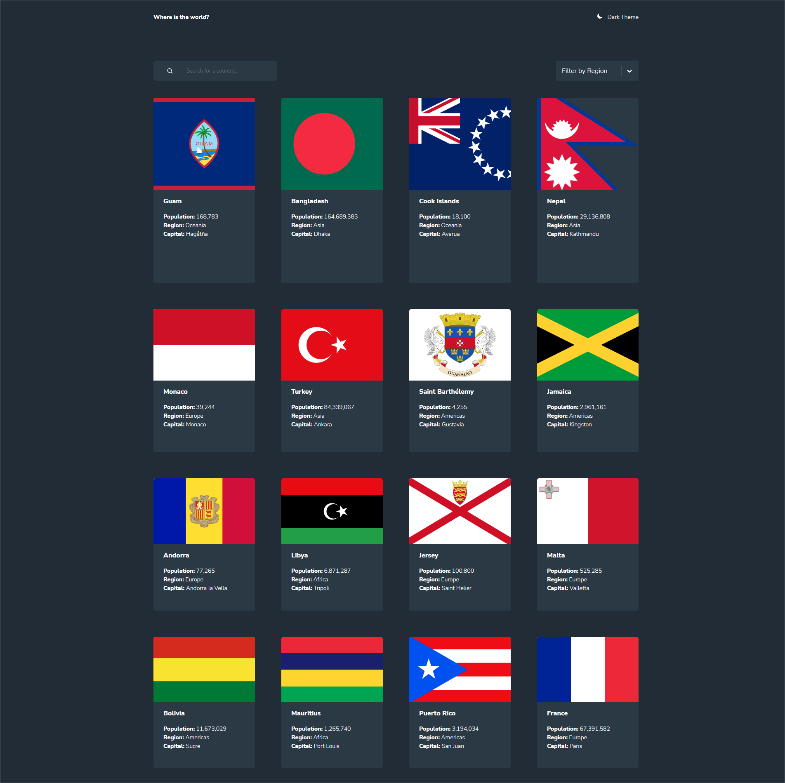

# Frontend Mentor - REST Countries API with color theme switcher solution

This is a solution to the REST Countries API with color theme switcher. it needs to integrate with the [REST Countries API](https://restcountries.com) to pull country data and display it like in the designs.

The users should be able to:

- See all countries from the API on the homepage
- Search for a country using an `input` field
- Filter countries by region
- Click on a country to see more detailed information on a separate page
- Click through to the border countries on the detail page
- Toggle the color scheme between light and dark mode

## Table of contents

- [Overview](#overview)
  - [Link](#link)
  - [Screenshots](#screenshots)
- [My process](#my-process)
  - [Built with](#built-with)
- [Author](#author)

## Overview

### Link

- Solution URL: [REST Countries API with color theme switcher](https://countries-with-color-theme-switcher-aislandmin.vercel.app/)

### Screenshots

## My process

### Built with

- Semantic HTML5 markup
- CSS custom properties
- Flexbox
- CSS Grid
- Mobile-first workflow
- [React](https://reactjs.org/) - JS library
- [Styled Components](https://styled-components.com/) - For styles
- [React Router v6](https://reactrouter.com/docs/en/v6)

## Author

- Website - [Xiaomin Guo](https://min-website-aislandmin.vercel.app/)
